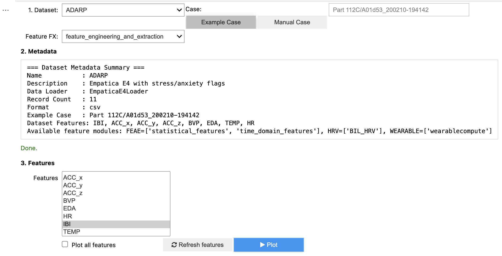
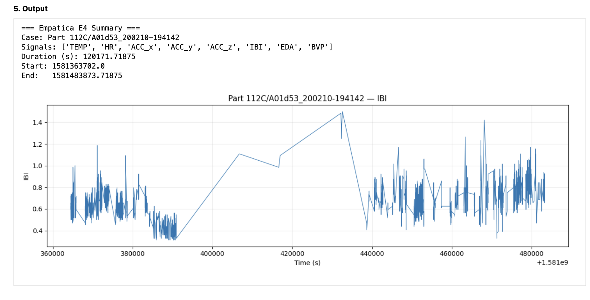
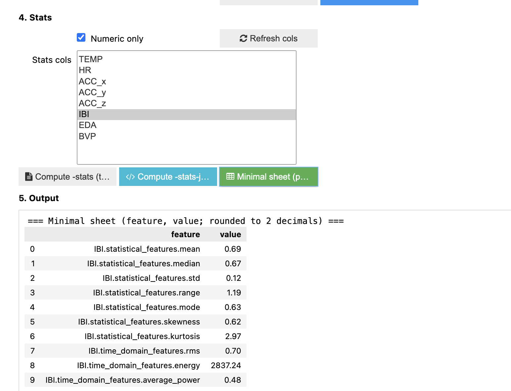

# Stress Dataset Loader

A flexible Python tool for loading, exploring, and plotting various stress-related and physiological datasets.

## Dataset Loader Features

- **Multiple dataset formats** via loaders:
  - `WFDBLoader`
  - `EmpaticaE4Loader`
  - `EDFLoader`
  - `PropofolLoader`
  - `MHealthLoader`
  - `CardioRespiratoryLoader`
- **Unified command-line interface** for:
  - Listing available datasets
  - Printing dataset metadata
  - Loading specific cases
  - Plotting selected features or all features
- **Metadata-driven loading** via `./metadata/<dataset>.json`


## Usage For DatasetLoaderUI (Jupyter Dataset Loader UI)

provide a Jupyter UI for for exploring, loading, and visualizing various biosignals.

**usage:**  

1. Open the notebook in VScode.
2. Run all cells.
3. Select a dataset from the dropdown.
4. Choose an example case or enter a manual case ID.
5. Select one feature, or enable "Plot all features".
6. Click Plot to visualize the signals.


## Usage For DatasetLoaderCli (Dataset Loader Command-Line Interface)

Run DatasetLoaderCli.py with the following options:

**usage:**  
```bash
DatasetLoaderCli.py [-h] [-dataset [DATASET]] [-case CASE | -example-case] [-plot PLOT] [-plot-all]
```

Flexible Dataset Loader: pick dataset, case, loader, and plot features.

**options:**
```text
-h, --help            Show this help message and exit.
-dataset [DATASET]    Dataset name.
                      Use `-dataset` with no value to list all datasets.
                      Use `-dataset <name>` to print dataset metadata summary.
-case CASE            Case identifier (record/subject/file/etc. per dataset).
                      Loads from `datasets/` folder.
-example-case         Load example case from `metadata["example_case"]` in `datasets_lite/`.
-plot PLOT            Comma-separated list of features to plot.
-plot-all             Plot all available features.
```

### Examples
1.	List available datasets:

    python DatasetLoaderCli.py -dataset

2.	Show metadata for a dataset:
    
    python DatasetLoaderCli.py -dataset autonomic-aging-cardiovascular

3.	Load an example case and plot all features:

    python DatasetLoaderCli.py -dataset autonomic-aging-cardiovascular -example-case -plot-all

4.	Load a specific case and plot selected features:

    python ./DatasetLoaderCli.py -dataset ADARP -example-case -plot EDA,HR


## Feature Extraction

The **Feature Extraction** module provides a unified bridge to multiple biosignal feature extraction providers from DBDP.  
It standardizes output into structured JSON and supports interoperability across datasets and tools.

Available DBDP Feature Extraction modules include:
- **Heart_Rate_Variability**
- **feature_engineering_and_extraction**
- **wearablecompute**

See the [Feature Extraction README](./FeatureExtraction/readme.md) for detailed usage and examples.

## UI screenshots

**preprocessing**

<p align="center">

</p>

**plotting**

<p align="center">

</p>

**feature extraction**

<p align="center">

</p>

## Sources & Citations

**Datasets:**

- **autonomic-aging-cardiovascular**
  - Schumann, A., & Bär, K. (2021). Autonomic Aging: A dataset to quantify changes of cardiovascular autonomic function during healthy aging (version 1.0.0). PhysioNet. RRID:SCR_007345. https://doi.org/10.13026/2hsy-t491

- **propofol-anesthesia-dynamics**
  - Subramanian, S., Purdon, P., Barbieri, R., & Brown, E. (2021). Behavioral and autonomic dynamics during propofol-induced unconsciousness (version 1.0). PhysioNet. RRID:SCR_007345. https://doi.org/10.13026/2rbc-1r03

- **wearable-device-dataset**
  - Hongn, A., Bosch, F., Prado, L., & Bonomini, P. (2025). Wearable Device Dataset from Induced Stress and Structured Exercise Sessions (version 1.0.0). PhysioNet. RRID:SCR_007345. https://doi.org/10.13026/zzf8-xv61

- **wearable-exam-stress**
  - Amin, M. R., Wickramasuriya, D., & Faghih, R. T. (2022). A Wearable Exam Stress Dataset for Predicting Cognitive Performance in Real-World Settings (version 1.0.0). PhysioNet. RRID:SCR_007345. https://doi.org/10.13026/kvkb-aj90

- **ADARP**
  - Ramesh Kumar Sah, Michael McDonell, Patricia Pendry, Sara Parent, Hassan Ghasemzadeh, & Michael J Cleveland. (2022). Alcohol and Drug Abuse Research Program (ADARP) Dataset (1.0) [Data set]. Zenodo. https://doi.org/10.5281/zenodo.6640290

- **affectiveroad**
  - El Haouij N., Poggi J.-M, Sevestre-Ghalila S., Ghozi R., and Jaidane M. 2018. AffectiveROAD system and database to assess driver's attention. In Proceedings of the 33rd Annual ACM Symposium on Applied Computing (SAC '18). ACM, New York, NY, USA, 800-803. DOI: https://doi.org/10.1145/3167132.3167395

- **EmoPairCompete**
  - Das, S., Clemmensen, L., & Lønfeldt, N. N. (2024). EmoPairCompete - Physiological Signals Dataset for Emotion and Frustration Assessment under Team and Competitive Behaviours (1.0) [Data set]. ICLR 2024 workshop on Time-series for Health (TS4H), Vienna. Zenodo. https://doi.org/10.5281/zenodo.11151714

- **WESAD**
  - Philip Schmidt, Attila Reiss, Robert Duerichen, Claus Marberger, and Kristof Van Laerhoven. 2018. Introducing WESAD, a Multimodal Dataset for Wearable Stress and Affect Detection. In Proceedings of the 20th ACM International Conference on Multimodal Interaction (ICMI '18). Association for Computing Machinery, New York, NY, USA, 400–408. https://doi.org/10.1145/3242969.3242985

- **scientisst-move-biosignals**
  - Areias Saraiva, J., Abreu, M., Carmo, A. S., Plácido da Silva, H., & Fred, A. (2024). ScientISST MOVE: Annotated Wearable Multimodal Biosignals recorded during Everyday Life Activities in Naturalistic Environments (version 1.0.1). PhysioNet. RRID:SCR_007345. https://doi.org/10.13026/hyxq-r919

- **wrist**
  - Delaram Jarchi and Alexander J. Casson. Description of a Database Containing Wrist PPG Signals Recorded during Physical Exercise with Both Accelerometer and Gyroscope Measures of Motion. Data 2017, 2(1), 1; doi:10.3390/data2010001

- **wearable-exercise-frailty**
  - Sokas, D., Butkuvienė, M., Tamulevičiūtė-Prascienė, E., Beigienė, A., Kubilius, R., Petrėnas, A., & Paliakaitė, B. (2022). Wearable-based signals during physical exercises from patients with frailty after open-heart surgery (version 1.0.0). PhysioNet. RRID:SCR_007345. https://doi.org/10.13026/mp8k-7p27

- **treadmill-exercise-cardioresp**
  - Mongin, D., García Romero, J., & Alvero Cruz, J. R. (2021). Treadmill Maximal Exercise Tests from the Exercise Physiology and Human Performance Lab of the University of Malaga (version 1.0.1). PhysioNet. RRID:SCR_007345. https://doi.org/10.13026/7ezk-j442

- **actes-cycloergometer-exercise**
  - Chabert, C., Mongin, D., Hermand, E., Collado, A., & Hue, O. (2022). Cardiorespiratory measurement from graded cycloergometer exercise testing (version 1.0.0). PhysioNet. RRID:SCR_007345. https://doi.org/10.13026/2qs3-kh43

- **ppg-dalia**
  - Reiss, A., Indlekofer, I., & Schmidt, P. (2019). PPG-DaLiA [Dataset]. UCI Machine Learning Repository. https://doi.org/10.24432/C53890.

- **nstdb**
  - Moody GB, Muldrow WE, Mark RG. A noise stress test for arrhythmia detectors. Computers in Cardiology 1984; 11:381-384.
  
- **mhealth-dataset**
  - Banos, O., Garcia, R., & Saez, A. (2014). MHEALTH [Dataset]. UCI Machine Learning Repository. https://doi.org/10.24432/C5TW22.


**Feature Extraction:**
   - Heart Rate Variability
 https://github.com/DigitalBiomarkerDiscoveryPipeline/Heart-Rate-Variability/

   - Feature Engineering and Extraction
 https://github.com/DigitalBiomarkerDiscoveryPipeline/feature-engineering-and-extraction

  - wearablecompute
https://github.com/DigitalBiomarkerDiscoveryPipeline/wearablecompute/